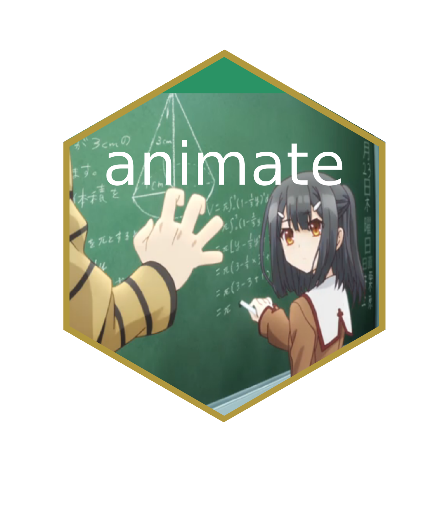

# animation 

<!-- badges: start -->
[](https://github.com/yihui/animation/actions)
[](https://cran.r-project.org/package=animation)
<!-- badges: end -->

## Recent updates

Original package via GitHub: https://github.com/yihui/animation  
pkgdown deployed website: https://jhu-statprogramming-fall-2023.github.io/biostat777-project3-part1-mlenorton/  
My 5 website customizations:  
- changed bootswatch to "lux" theme  
- changed height of navigation bar  
- changed navigation bar background color  
- added a homemade hex sticker  
- set size of hex sticker

## Introduction

This is an R package to create and export animations to a variety of formats
(HTML/JS, GIF, Video, PDF), and it also serves as a gallery of statistical
animations.

## Installation

To install the stable version on CRAN:

```s
install.packages('animation')
```

To install the GitHub version under development:

```s
install.packages('animation', repos = 'https://xran.yihui.org')
```

If you want to contribute, the documentation and NAMESPACE of this package
are generated by **roxygen2** and **Rd2roxygen**:

```s
if (!require('Rd2roxygen') install.packages('Rd2roxygen')
Rd2roxygen::rab('animation', install = TRUE)
```
## Author

**Maintainer**: Yihui Xie  
**Website developer and author of example analysis**: Emily Norton

## Exported functions with description

ani.options(): Set or query animation options

ani.record(): Record and replay animations

animation-package(): A Gallery of Animations in Statistics and Utilities to Create Animations

bisection.method(): The Bisection Method for root-finding on an interval

BM.circle(): Brownian Motion in a Circle

boot.iid(): Bootstrapping the i.i.d data

boot.lowess(): Bootstrapping with LOWESS

brownian.motion(): Demonstration of Brownian Motion

buffon.needle(): Simulation of Buffons Needle

clt.ani(): Demonstration of the Central Limit Theorem

conf.int(): Demonstration of Confidence Intervals

cv.ani(): Demonstration of the k-fold Cross Validation

cv.nfeaturesLDA(): Cross-validation to find the optimum number of features (variables) in LDA

flip.coin(): Probability in flipping coins

grad.desc(): Demonstration of the Gradient Descent Algorithm

im.convert(): A wrapper for the convert utility of ImageMagick or GraphicsMagick.

kmeans.ani(): Demonstration of the K-means Cluster Algorithm

knn.ani(): Demonstration of the k-Nearest Neighbour (kNN) classification

least.squares(): Demonstrate the least squares method

lln.ani(): Demonstration of the Law of Large Numbers

MC.hitormiss(): Hit or Miss Monte Carlo Integration

MC.samplemean(): Sample Mean Monte Carlo Integration

moving.block(): Cycle through an R object and plot each subset of elements

mwar.ani(): Demonstration of Moving Window Auto-Regression

newton.method(): Demonstration of the Newton-Raphson method for root-finding

pdftk(): A wrapper for the PDF toolkit Pdftk

price.ani(): Stock prices of Vanke

qpdf(): A wrapper for the PDF toolkit qpdf

quincunx(): Demonstration of the Galton Box, example 1

quincunx2(): Demonstration of the Galton Box, example 2

Rosling.bubbles(): The Bubbles Animation in Hans Roslings Talk

sample.cluster(): Demonstration of the cluster sampling

sample.ratio(): Demonstration of the Ratio Estimation in Sampling Survey

sample.simple(): Demonstration of the simple random sampling without replacement

sample.strat(): Demonstration of the stratified sampling

sample.system(): Demonstration of the systematic sampling

saveGIF(): Convert images to a single animation file (typically GIF) using ImageMagick or GraphicsMagick

saveHTML(): Insert animations into an HTML page

saveLatex(): Insert animations into a LaTeX document and compile it

saveSWF(): Convert images to Flash animations

saveVideo(): Convert a sequence of images to a video by FFmpeg

sim.qqnorm(): Simulation of QQ plots for the Normal distribution

vanke1127(): Stock price of Vanke

vi.lilac.chaser(): Visual Illusions: Lilac Chaser

## Example  
Here is an example for the boot.iid() function:

```s
library(animation)
## bootstrap for 20 random numbers from U(0, 1)
par(mar = c(1.5, 3, 1, 0.1), cex.lab = 0.8, cex.axis = 0.8, mgp = c(2, 0.5, 0), tcl = -0.3)
ani.options(nmax = 50)
## don't want the titles
boot.iid(main = c("", ""))
```

## Contact

Bugs and feature requests can be filed to
<https://github.com/yihui/animation/issues>. Pull requests are also welcome.

